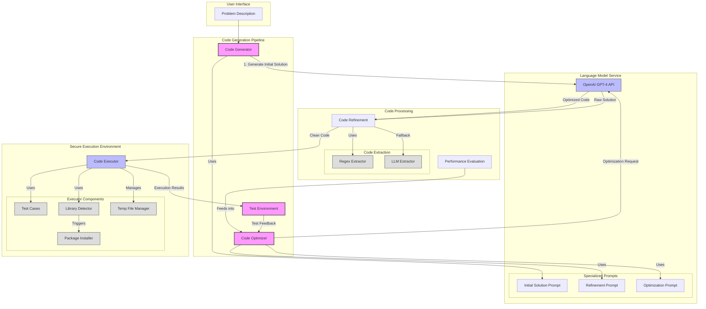

# LLM-Powered Code Generation & Optimization System

This system leverages Large Language Models (LLMs) to automatically generate, test, and optimize Python code solutions. By combining the power of GPT-4 with a secure execution environment, it creates an end-to-end pipeline for producing high-quality, efficient code solutions from natural language problem descriptions.

## Overview

The system follows an iterative approach to code generation and optimization:

1. A problem description is provided as input
2. The LLM generates an initial solution
3. The solution is tested in a secure execution environment
4. Based on test results, the code is either refined for correctness or optimized for performance
5. The process continues until an optimal solution is found

## Architecture Diagram



## Features

Our system provides several advanced capabilities:

- **Secure Code Execution**: All generated code runs in an isolated environment with proper security measures
- **Automatic Dependency Management**: The system detects and installs required Python packages
- **Intelligent Code Extraction**: Uses both regex pattern matching and LLM-based approaches to clean and prepare code
- **Performance Optimization**: Automatically identifies and optimizes performance bottlenecks
- **Test-Driven Development**: Validates solutions against predefined test cases
- **Error Recovery**: Maintains previous working solutions while attempting optimizations

## Installation

First, clone the repository and set up a Python virtual environment:

```bash
git clone https://github.com/yourusername/llm-code-generator.git
cd llm-code-generator
python -m venv venv
source venv/bin/activate  # On Windows, use: venv\Scripts\activate
pip install -r requirements.txt
```

Create a `.env` file in the project root and add your OpenAI API key:

```env
OPENAI_API_KEY=your_api_key_here
```


## Usage

Here's a basic example of how to use the system:

```python
from src.code_generation_pipeline import CodeGenerationPipeline

# Initialize the pipeline
pipeline = CodeGenerationPipeline()

# Define your problem
problem_description = """
Write a function that finds the nth Fibonacci number using dynamic programming.
The function should take an integer n as input and return the nth Fibonacci number.
"""

# Generate and optimize the solution
solution = pipeline.run(problem_description)

# Print results
print(f"Solution is correct: {solution.is_correct}")
print(f"Execution time: {solution.execution_time:.3f}s")
print("\nGenerated Code:")
print(solution.code)
```

## Configuration

The system can be configured through several parameters:

- `timeout`: Maximum execution time for generated code (default: 30 seconds)
- `max_iterations`: Maximum number of refinement attempts (default: 5)
- `model_name`: GPT model to use (default: "gpt-4")

You can adjust these in the pipeline initialization:

```python
pipeline = CodeGenerationPipeline(
    model_name="gpt-4",
    timeout=60,
    max_iterations=10
)
```

## Components

### Code Generator

The code generator uses OpenAI's GPT-4 to create Python code solutions. It employs carefully crafted prompts for:
- Initial solution generation
- Code refinement based on test feedback
- Performance optimization

### Code Executor

The secure execution environment provides:
- Isolation of executed code
- Automatic dependency detection and installation
- Resource usage monitoring
- Timeout enforcement
- Output and error capturing

### Test Environment

The testing system:
- Manages test case definitions
- Validates solution correctness
- Measures performance metrics
- Provides detailed feedback for refinement

### Performance Optimizer

The optimization component:
- Identifies performance bottlenecks
- Suggests algorithmic improvements
- Validates optimizations maintain correctness
- Tracks execution time improvements


## Acknowledgments

This project builds upon several open-source technologies:
- OpenAI's GPT-4 API
- Python's subprocess and tempfile modules
- Various testing and security frameworks

For more information or support, please open an issue on the GitHub repository.
