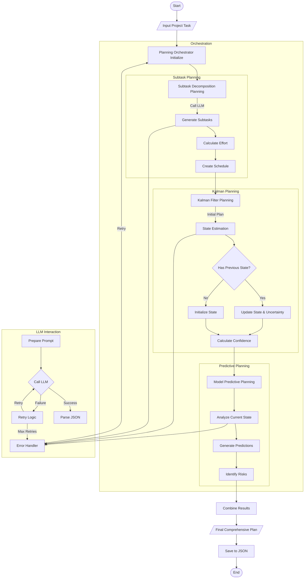

## Architecture

```mermaid
flowchart TD
    Start([Start]) --> Input[/Input Project Task/]
    Input --> Orchestrator[Planning Orchestrator Initialize]
    
    subgraph Orchestration
        Orchestrator --> SD[Subtask Decomposition Planning]
        
        subgraph "Subtask Planning"
            SD --> |Call LLM| SD1[Generate Subtasks]
            SD1 --> SD2[Calculate Effort]
            SD2 --> SD3[Create Schedule]
        end
        
        SD3 --> KF[Kalman Filter Planning]
        
        subgraph "Kalman Planning"
            KF --> |Initial Plan| KF1[State Estimation]
            KF1 --> KF2{Has Previous State?}
            KF2 --> |Yes| KF3[Update State & Uncertainty]
            KF2 --> |No| KF4[Initialize State]
            KF3 --> KF5[Calculate Confidence]
            KF4 --> KF5
        end
        
        KF5 --> MP[Model Predictive Planning]
        
        subgraph "Predictive Planning"
            MP --> MP1[Analyze Current State]
            MP1 --> MP2[Generate Predictions]
            MP2 --> MP3[Identify Risks]
        end
    end
    
    MP3 --> Result[Combine Results]
    Result --> Output[/Final Comprehensive Plan/]
    Output --> Save[Save to JSON]
    Save --> End([End])
    
    %% Error handling
    SD1 --x E1[Error Handler]
    KF1 --x E1
    MP1 --x E1
    E1 --> |Retry| Orchestrator
    
    %% LLM calls with retry
    subgraph "LLM Interaction"
        direction TB
        L1[Prepare Prompt] --> L2{Call LLM}
        L2 --> |Success| L3[Parse JSON]
        L2 --> |Failure| L4[Retry Logic]
        L4 --> |Max Retries| E1
        L4 --> |Retry| L2
    end
```
