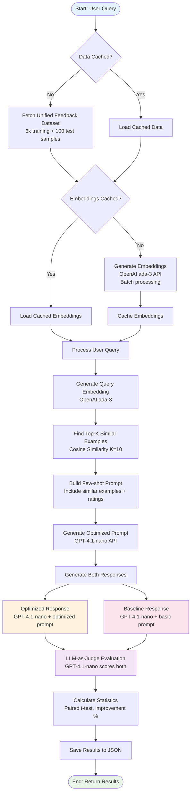
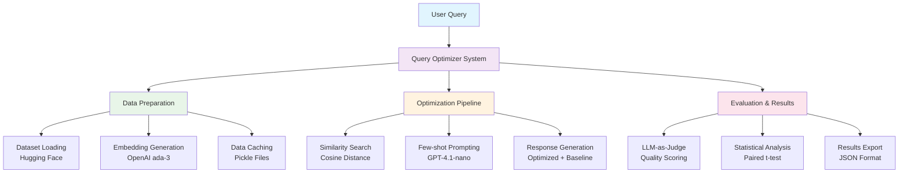
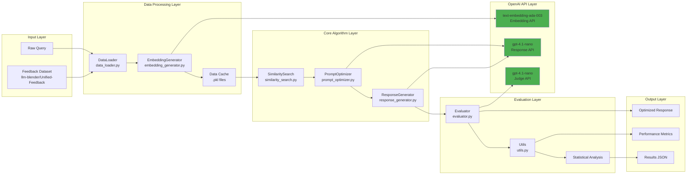
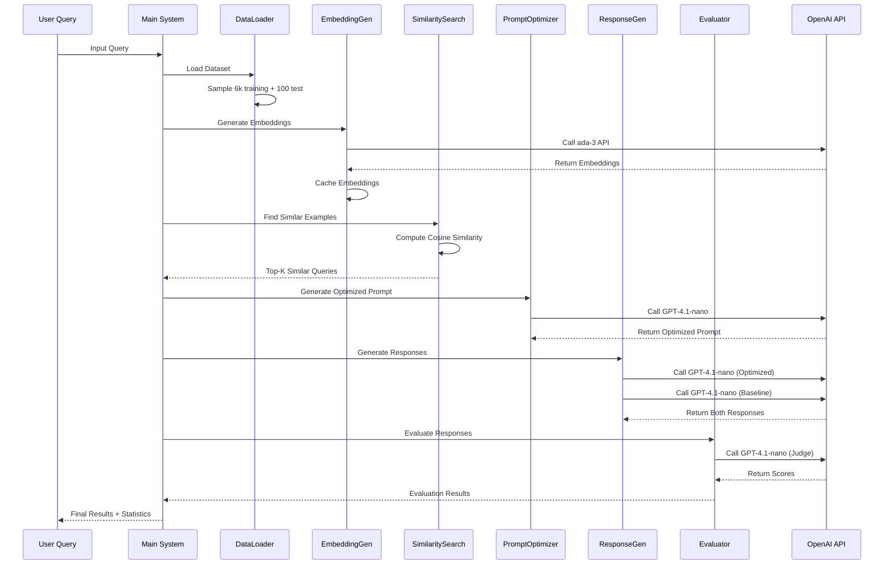

# OpenAI Query Optimizer

A complete implementation of query response optimization using OpenAI models, embeddings, and few-shot prompting based on user feedback patterns.

## Overview

This system automatically improves AI assistant responses by learning from user feedback patterns. It uses OpenAI's text-embedding-ada-003 for semantic similarity search and GPT-4.1-nano for response generation and evaluation.

### Key Features

- **Semantic Similarity Search**: Uses OpenAI ada-3 embeddings to find similar queries
- **Few-shot Prompting**: Leverages successful response patterns from user feedback
- **Statistical Validation**: Includes paired t-test evaluation for significance testing
- **LLM-as-a-Judge**: Automated response quality evaluation
- **Modular Architecture**: Clean, maintainable code structure

## Project Structure

```
openai-query-optimizer/
├── README.md                 # This file
├── requirements.txt          # Python dependencies
├── config.py                # Configuration settings
├── data_loader.py           # Dataset loading and sampling
├── embedding_generator.py   # OpenAI embedding generation
├── similarity_search.py     # Cosine similarity search
├── prompt_optimizer.py      # Few-shot prompt optimization
├── response_generator.py    # Response generation with OpenAI
├── evaluator.py            # LLM-as-a-judge evaluation
├── main.py                 # Main execution script
├── utils.py                # Utility functions and statistics
├── data/                   # Data directory (created automatically)
└── results/                # Results directory (created automatically)
```

## Installation

1. **Clone the repository** (or create the project structure):
```bash
mkdir openai-query-optimizer
cd openai-query-optimizer
```

2. **Install dependencies**:
```bash
pip install -r requirements.txt
```

3. **Set up environment variables**:
Create a `.env` file in the project root:
```env
OPENAI_API_KEY=your_openai_api_key_here
```

## Configuration

The system is configured through `config.py`. Key parameters:

- **EMBEDDING_MODEL**: `"text-embedding-ada-003"` (OpenAI ada-3)
- **RESPONSE_MODEL**: `"gpt-4.1-nano"` (for response generation)
- **JUDGE_MODEL**: `"gpt-4.1-nano"` (for evaluation)
- **TRAINING_SAMPLE_SIZE**: `6000` (training examples)
- **TEST_SAMPLE_SIZE**: `100` (test queries)
- **SIMILARITY_K**: `10` (number of similar examples for few-shot)

## Usage

### Quick Start

```bash
python main.py
```

This will:
1. Load the Unified Feedback Dataset from Hugging Face
2. Generate embeddings for training queries
3. Run evaluation on test dataset
4. Display statistical results
5. Run demo with sample queries

### Custom Usage

```python
from main import QueryOptimizer

# Initialize optimizer
optimizer = QueryOptimizer()

# Prepare data
optimizer.prepare_data()

# Optimize a single query
result = optimizer.optimize_single_query("How do I reset my password?")
print(f"Optimized Score: {result['optimized_score']}")
print(f"Response: {result['optimized_response']}")

# Run full evaluation
results, stats = optimizer.run_evaluation()
```

### Demo Mode

```python
# Run demo with custom queries
demo_queries = [
    "What is the company vacation policy?",
    "How to improve productivity?",
    "Explain AI in simple terms"
]
optimizer.run_demo(demo_queries)
```

### Detailed Process Flow



### System Architecture

### High-Level System Overview



### Low-Level Component Architecture



### Data Flow Diagram



### Component Interaction Matrix

| Component | DataLoader | EmbeddingGen | SimilaritySearch | PromptOptimizer | ResponseGen | Evaluator | Utils |
|-----------|------------|--------------|------------------|-----------------|-------------|-----------|-------|
| **DataLoader** | ✓ | Provides data | Provides data | Provides data | - | Provides data | - |
| **EmbeddingGen** | Uses data | ✓ | Provides embeddings | - | - | - | - |
| **SimilaritySearch** | Uses data | Uses embeddings | ✓ | Provides examples | - | - | - |
| **PromptOptimizer** | - | - | Uses examples | ✓ | Provides prompts | - | - |
| **ResponseGen** | - | - | - | Uses prompts | ✓ | Provides responses | - |
| **Evaluator** | Uses examples | - | - | - | Uses responses | ✓ | Provides scores |
| **Utils** | - | - | - | - | - | Uses scores | ✓ |

## Algorithm Details

### 1. Data Collection
- Uses the [Unified Feedback Dataset](https://huggingface.co/datasets/llm-blender/Unified-Feedback)
- Extracts user queries, responses, and binary ratings (0=dislike, 1=like)
- Samples 6,000 training examples and 100 test queries

### 2. Embedding Generation
```python
# Generate embeddings using OpenAI ada-3
embedding = client.embeddings.create(
    model="text-embedding-ada-003",
    input=text
).data[0].embedding
```

### 3. Similarity Search
- Computes cosine similarity between query embeddings
- Finds top-K most similar examples from training data
- Uses K=10 for optimal balance of diversity and relevance

### 4. Few-shot Prompt Optimization
```python
# Build few-shot prompt with similar examples
prompt = """
You are an expert prompt optimizer. Given examples of 
similar queries with user feedback, create an optimized 
prompt that incorporates successful patterns.

Examples:
User Query: {example_query}
Response: {example_response}  
Feedback: 👍/👎

Target Query: {user_query}
Optimized Prompt: ...
"""
```

### 5. Response Generation
```python
# Generate optimized response
response = client.responses.create(
    model="gpt-4.1-nano",
    input=f"{optimized_prompt}\n\nUser Query: {query}\n\nResponse:"
)
```

### 6. LLM-as-a-Judge Evaluation
- Uses GPT-4.1-nano to evaluate response quality
- Compares against few-shot examples
- Returns binary score (0=bad, 1=good) with reasoning

## Performance Metrics

The system tracks several key metrics:

- **Improvement Rate**: Percentage improvement over baseline
- **Statistical Significance**: P-value from paired t-test
- **Mean Scores**: Average satisfaction scores for optimized vs baseline
- **Success Rate**: Percentage of queries with improved responses

### Expected Results
Based on the original AWS implementation:
- **~3-4% improvement** in user satisfaction scores
- **Statistical significance** (p-value < 0.05)
- **Consistent improvements** across different query types

## Advanced Usage

### Custom Dataset

```python
# Use your own feedback data
import pandas as pd

custom_data = pd.DataFrame({
    'conv_A_user': ['Your queries...'],
    'conv_A_assistant': ['Your responses...'], 
    'conv_A_rating': [1, 0, 1, ...]  # Binary ratings
})

# Set custom data
optimizer.training_data = custom_data
```

### Batch Processing

```python
# Process multiple queries efficiently
queries = ["Query 1", "Query 2", "Query 3"]
results = []

for query in queries:
    result = optimizer.optimize_single_query(query)
    results.append(result)
```

### Configuration Tuning

```python
# Adjust parameters in config.py
Config.SIMILARITY_K = 15        # More examples
Config.TEMPERATURE = 0.5        # More conservative responses
Config.MAX_TOKENS = 1500        # Longer responses
```

## File Descriptions

### Core Components

- **`config.py`**: Central configuration management
- **`data_loader.py`**: Handles dataset loading and sampling from Hugging Face
- **`embedding_generator.py`**: OpenAI embedding generation with batching and caching
- **`similarity_search.py`**: Cosine similarity computation and ranking
- **`prompt_optimizer.py`**: Few-shot prompt generation based on similar examples
- **`response_generator.py`**: Response generation using optimized and baseline prompts
- **`evaluator.py`**: LLM-as-a-judge evaluation system
- **`utils.py`**: Statistical analysis and result management
- **`main.py`**: Main orchestration and execution

### Data Flow

1. **Data Loading** → Load feedback dataset
2. **Embedding Generation** → Create vector representations
3. **Similarity Search** → Find relevant examples
4. **Prompt Optimization** → Generate improved prompts
5. **Response Generation** → Create optimized responses
6. **Evaluation** → Score and compare responses
7. **Statistical Analysis** → Validate improvements

## Troubleshooting

### Common Issues

1. **OpenAI API Key Error**:
   ```bash
   Error: OPENAI_API_KEY environment variable is required
   ```
   Solution: Set your OpenAI API key in `.env` file

2. **Rate Limiting**:
   ```bash
   Error generating embedding: Rate limit exceeded
   ```
   Solution: The system includes automatic rate limiting with delays

3. **Memory Issues**:
   ```bash
   MemoryError: Unable to allocate array
   ```
   Solution: Reduce `TRAINING_SAMPLE_SIZE` in config.py

4. **Dataset Loading Issues**:
   ```bash
   Error loading dataset: Connection timeout
   ```
   Solution: Check internet connection or use cached data

### Performance Optimization

- **Batch Processing**: Embeddings are generated in batches
- **Caching**: Embeddings and data are cached to disk
- **Rate Limiting**: Automatic delays prevent API errors
- **Error Handling**: Robust error handling with fallbacks

## API Usage Examples

### Individual Components

```python
# Generate embeddings
from embedding_generator import EmbeddingGenerator
generator = EmbeddingGenerator()
embedding = generator.get_embedding("Sample text")

# Find similar examples
from similarity_search import SimilaritySearch
searcher = SimilaritySearch()
similar = searcher.find_similar_examples(embedding, data_df)

# Generate optimized prompt
from prompt_optimizer import PromptOptimizer
optimizer = PromptOptimizer()
result = optimizer.get_optimized_prompt(query, similar_examples)

# Evaluate responses
from evaluator import Evaluator
evaluator = Evaluator()
score = evaluator.judge_response(query, response, examples)
```

## Extensions and Customization

### Adding New Models

```python
# In config.py
EMBEDDING_MODEL = "text-embedding-3-large"  # Upgrade embedding model
RESPONSE_MODEL = "gpt-4"                    # Use different response model
```

### Custom Evaluation Metrics

```python
# Add custom evaluation in evaluator.py
def evaluate_custom_metric(self, response):
    # Your custom evaluation logic
    return custom_score
```

### Integration with Other Systems

```python
# Example Flask API integration
from flask import Flask, request, jsonify
from main import QueryOptimizer

app = Flask(__name__)
optimizer = QueryOptimizer()
optimizer.prepare_data()

@app.route('/optimize', methods=['POST'])
def optimize_query():
    query = request.json['query']
    result = optimizer.optimize_single_query(query)
    return jsonify(result)
```

## Contributing

1. Fork the repository
2. Create a feature branch
3. Make your changes
4. Add tests if applicable
5. Submit a pull request

## License

This project is open source. Please ensure you comply with OpenAI's usage policies when using their APIs.

## Support

For issues and questions:
1. Check the troubleshooting section
2. Review the configuration options
3. Examine the error logs in the console output
4. Ensure all dependencies are properly installed

## Acknowledgments

- Based on the AWS blog post: "Optimize query responses with user feedback using Amazon Bedrock embedding and few-shot prompting"
- Uses the Unified Feedback Dataset from Hugging Face
- Implements statistical validation methods from academic research

---

**Note**: This implementation requires an OpenAI API key and will incur costs based on your usage of the embedding and language models. Monitor your usage through the OpenAI dashboard.
