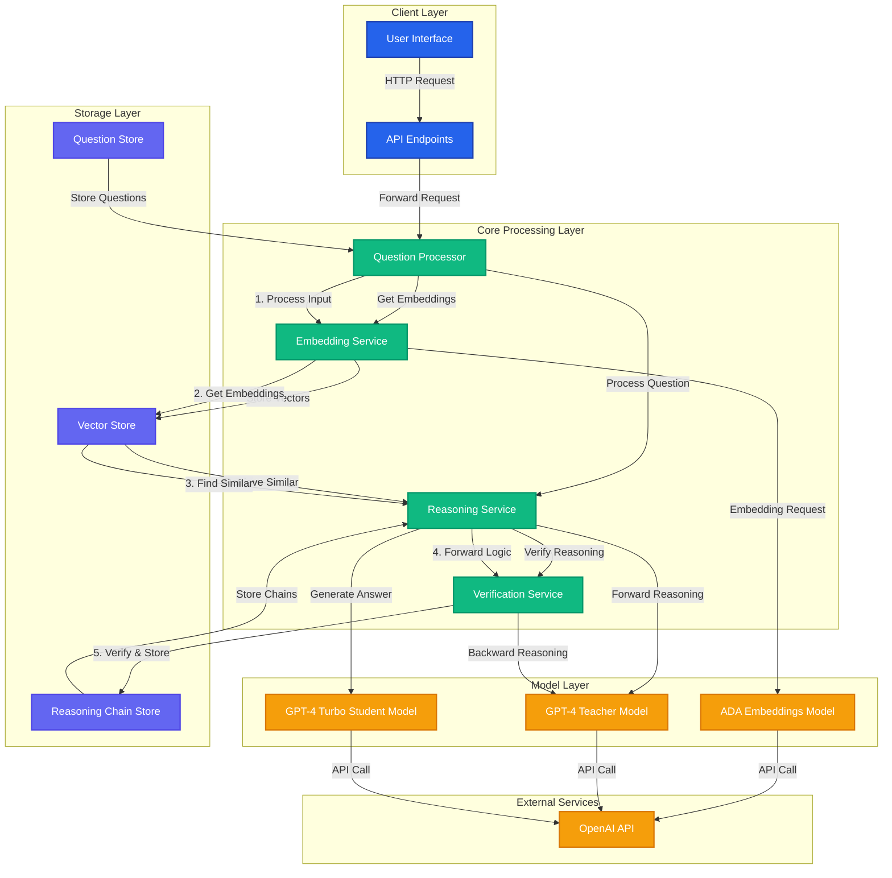

# Bidirectional Reasoning in LLMs

This repository implements bidirectional reasoning for Large Language Models, inspired by the research paper "Reverse Thinking Makes LLMs Stronger Reasoners" (UNC Chapel Hill & Google Research). The implementation demonstrates how LLMs can validate their reasoning by thinking both forward and backward, similar to human problem-solving processes.

## Extended Architecture Diagram



## 🚀 Key Features

- Forward and backward reasoning paths
- Similarity-based case retrieval
- Consistency verification
- In-memory vector storage
- Configurable model selection (GPT-4, other compatible models)

## 💡 How It Works

The system implements a four-stage process for enhanced reasoning:

### 1. Input Processing
- Takes a question as input
- Generates embeddings using OpenAI's embedding model
- Finds similar cases from the knowledge base

### 2. Forward Reasoning
- Retrieves context from similar cases
- Generates step-by-step forward reasoning
- Produces an initial answer

### 3. Backward Verification
- Generates a reverse question from the answer
- Performs backward reasoning
- Verifies consistency between forward and backward paths

### 4. Result Processing
- Stores verified results in the knowledge base
- Updates similar cases database
- Discards inconsistent results

## 🛠️ Installation

```bash
# Clone the repository
git clone https://github.com/yourusername/bidirectional-reasoning.git

# Install dependencies
pip install -r requirements.txt

# Set up environment variables
cp .env.example .env
# Add your OpenAI API key to .env
```

## 📋 Requirements

- Python 3.8+
- OpenAI API key
- Dependencies:
  - openai
  - python-dotenv
  - numpy
  - scipy
  - tenacity

## 🔧 Usage

```python
from reasoning_service import HealthcareReasoningService

# Initialize the service
service = HealthcareReasoningService()

# Process a question
async def ask_question():
    question = "Your medical question here"
    response = await service.answer_question(question)
    print(response)
```

## 🌟 Example

```python
# Example medical diagnosis question
question = "A 50-year-old patient presents with chest tightness and arm pain after exercise. What should be the immediate assessment?"

# Get response with both forward and backward reasoning
response = await service.answer_question(question)
```

## 🔄 Process Flow

1. **Question Input**
   - User submits a question
   - System generates embeddings
   - Similar cases are retrieved

2. **Forward Analysis**
   - Context compilation from similar cases
   - Step-by-step forward reasoning
   - Initial answer generation

3. **Backward Verification**
   - Generate reverse question
   - Perform backward reasoning
   - Verify consistency

4. **Result Handling**
   - Store verified results
   - Update knowledge base
   - Handle inconsistencies

## 🔍 Current Limitations

- In-memory storage (can be extended to vector databases)
- Limited to the context window of the underlying LLM
- Requires API calls for each reasoning step
- Performance depends on the quality of similar cases

## 🚀 Future Improvements

1. Integration with dedicated vector databases
2. Model fine-tuning for specific domains
3. Batch processing capabilities
4. Caching mechanism for frequent queries
5. Extended validation metrics
