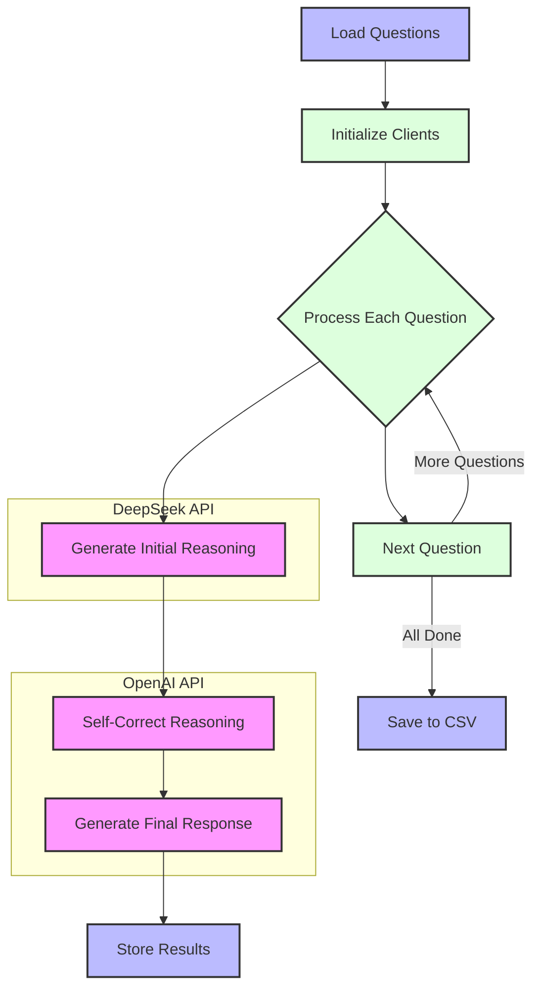
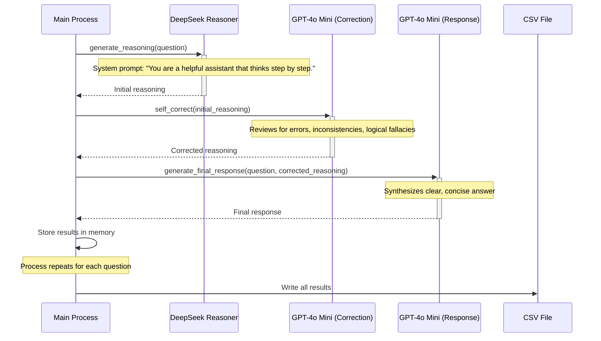

# Reasoning Enhancement System

## Overview
The Reasoning Enhancement System is an AI-powered question-answering pipeline that utilizes multiple language models to produce high-quality responses to complex questions. The system combines DeepSeek Reasoner's step-by-step reasoning capabilities with OpenAI's models for verification and refinement.

## Features
- Step-by-step reasoning for complex questions across multiple domains
- Self-correction mechanism to identify and fix logical errors
- Final response generation that is clear and concise
- Support for a variety of question types:
  - Complex mathematical reasoning
  - Logical reasoning and paradoxes
  - Systems thinking
  - Ethical dilemmas

## Architecture
The system follows a three-stage pipeline:
1. **Initial Reasoning**: DeepSeek Reasoner generates detailed step-by-step reasoning
2. **Self-Correction**: GPT-4o Mini reviews the reasoning for errors and inconsistencies
3. **Final Response**: GPT-4o Mini synthesizes a clear, concise answer based on the corrected reasoning



## Flow Diagram


## Requirements
- Python 3.6+
- OpenAI API key
- DeepSeek API key
- Required Python packages:
  - openai
  - python-dotenv

## Installation

1. Clone the repository:
```bash
git clone https://github.com/yourusername/reasoning-enhancement-system.git
cd reasoning-enhancement-system
```

2. Install the required packages:
```bash
pip install -r requirements.txt
```

3. Create a `.env` file in the project root with your API keys:
```
OPENAI_API_KEY=your_openai_api_key
DEEPSEEK_API_KEY=your_deepseek_api_key
```

## Usage

Run the main script:
```bash
python main.py
```

The script will:
- Process each question in the predefined list
- Generate reasoning, corrections, and final responses
- Print the results to the console
- Save all results to a CSV file named `enhanced_qa_results.csv`

## Customization

To customize the questions or expand the system's capabilities:

1. Modify the `questions` list in the main script
2. Adjust model parameters like temperature and max_tokens for different outputs
3. Extend the pipeline with additional processing steps

## Output

The system outputs:
- Console logs showing each question and its final response
- A CSV file containing:
  - Question ID
  - Question text
  - Initial reasoning from DeepSeek
  - Corrected reasoning
  - Final response

## Performance Considerations

- API rate limits may affect processing speed for large batches
- Consider costs associated with model usage, especially for longer reasoning chains
- For production use, add error handling and retry mechanisms

## Future Enhancements

- Web interface for interactive querying
- Support for additional models and providers
- Benchmarking against human expert answers
- Domain-specific reasoning templates
